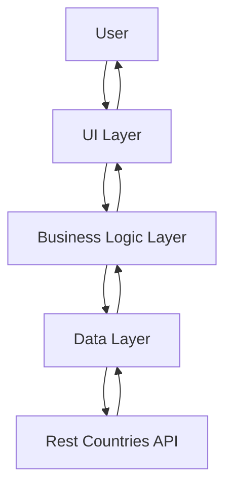

# World Flags App

## Table of Contents

- [Introduction](#introduction)
- [Features](#features)
- [Application Architecture](#application-architecture)
- [Running the Application](#running-the-application)

## Introduction

The World Flags App is a simple, user-friendly application that showcases all the flags from around the world in a single page. The application is designed to be interactive, whereby clicking on a flag displays the name of the country it represents.

## Features

- **Display All Flags**: The World Flags App hosts all the world flags in a single page for easy viewing and access.
- **Interactive Flags**: Each flag is interactive. Clicking on a flag reveals the name of the country it represents.
- **User Friendly Interface**: The app has a simple and intuitive interface that is easy to navigate, even for first-time users.

## Application Architecture

The World Flags App is built with a modular architecture, which aligns with modern software development best practices.

Here's a basic flowchart representation of the application architecture:

In this graph:

- `User` represents the user interactions with the application.
- `UI Layer` represents the Presentation layer where all UI components are defined.
- `Business Logic Layer` processes user interactions and makes calls to the data layer as needed.
- `Data Layer` is responsible for data management, fetching data from the Rest Countries API.
- `Rest Countries API` is the external API where all the data related to flags and countries are fetched from.

The arrows represent the direction of the data flow and interactions between the different layers.

## Running the Application

To run the World Flags App, follow these steps:

1. Clone or download the repository to your local machine.
2. Navigate to the application directory in your terminal or command prompt.
3. Run `npm install` to install all the application dependencies.
4. Once the installation is complete, start the application by running `npm start`.
5. Navigate to `http://localhost:3000` in your web browser to access the application.

Note: You must have Node.js and npm installed on your machine to run this application.

Please report any issues or bugs to the development team for further investigation. Your feedback is highly appreciated.

Enjoy exploring the world flags!

[Back To The Top](#world-flags-app)